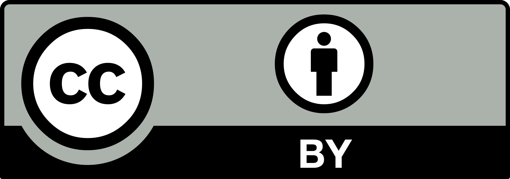

## Grundidee der lernOS Leitfäden

Ein lernOS Leitfaden hilft Lernenden durch einen vorgegebenen Lernpfad ihr eigenes Lernziel im Rahmen eines Learning Sprints (3 Monate) zu erlernen zu erreichen. Die Lernenden lernen dabei allein, im Lerntandem oder in einem Learning Circle (4-5 Personen). Der zeitliche Aufwand über den Sprint sollte maximal zwei Stunden pro Woche betragen. Das Lernziel kann dabei aus einem oder einer Kombination dieser Bereiche kommen:

* **MINDSET** - eine bestimmte Haltung entwickeln
* **SKILLSET** - eine Fähigkeit erlernen
* **TOOLSET** - ein Tool oder eine Methode beherrschen

Die Woche 0 und 12 im Learning Sprint sind immer für Planung und Retrospektive vorgesehen, in Woche 4 und 8 findet ein sog. Boxenstopp zur Zwischenreflexion des Lernfortschritts statt. Die Wochen 1-11 können mit Übungen (mindestens 11), [Katas](https://de.wikipedia.org/wiki/Kata_(Programmierung)) genannt, gefüllt werden. Eine Kata sollte einen Übenden zw. 30-60 Minuten Zeit kosten und auf nicht mehr als zwei DIN A4 Seiten beschrieben sein (Sushi-Card-Prinzip).

Ein lernOS Leitfaden steht immer unter der [Creative Commons Namensnennung 4.0 International Lizenz](https://creativecommons.org/licenses/by/4.0/deed.de) (CC BY). Die Lizenz gilt auch für im Leitfaden  verwendete Bilder. Alle Inhalte müssen auch in bearbeitbaren  Quellformaten vorliegen (bei Bildern z.B. PNG und SVG). Die Inhalte eines lernOS Leitfaden werden als [Repository auf GitHub](https://github.com) verwaltet, um offenen Zugang und einfach Wiederverwendung zu gewähleisten.

Dadurch können lernOS Inhalte für jeden Zweck offen zugegriffen, genutzt, verändert und geteilt werden (auch für kommerzielle Anwendungen). Produkte und Dienstleistungen dürfen allerdings nicht den Begriff "lernOS" im Namen tragen. Dieser Ansatz ist vergleichbar mit dem Browser [Chromium](https://de.wikipedia.org/wiki/Chromium_(Browser)) und den darauf aufsetzenden Produkten [Google Chrome](https://de.wikipedia.org/wiki/Google_Chrome), [Microsoft Edge](https://de.wikipedia.org/wiki/Microsoft_Edge), [Opera](https://de.wikipedia.org/wiki/Opera_(Browser)) und Brave.

## Lebenszyklus eines Leitfadens

Von der Idee bis zur Fertigstellung durchläuft ein lernOS Leitfaden verschiedene Phasen, die wir als [Lebenszyklus](https://de.wikipedia.org/wiki/Lebenszyklus) des Leitfadens bezeichnen. Auch wenn die Geschichte jedes Leitfadens anders verläuft, lassen sich grob folgende Phasen benennen:

* **Idee** - dine Einzelperson oder eine Gruppe von Personen hat die Idee für einen lernOS Lernpfad oder einen lernOS Leitfaden.
* **Zieldefinition** - die Idee konkretisierte sich, Lernziel und Zielgruppe der Lernenden werden klarer. Oft entstehen hier auch schon erste Inhalte z.B. in Form von Skizzen, Mitschriften, Mailverkehr etc.
* **Erstellung** - in dieser Phase werden Struktur und Inhalte erstellt. Lernpfade können in Formaten wie Word, als Google Doc oder PowerPoint entstehen, lernOS Leitfäden haben immer Markdown als Quellformat.
* **Veröffentlichung** - der Leitfaden wir als Repository auf GitHub veröffentlicht. Standardmäßig werden neben Markdown die Formate PDF, Word, HTML, und E-Book (EPUB, Mobipocket) produziert. Ist der Lernpfad eines Leitfaden noch nicht in der Praxis getestet, empfehlen wir 0.x Versionsnummer. Nach absolviertem Praxistest erhält der Leitfaden dann die Versionsnummer 1.0. Diese sollte dann mindestens in Deutsch und Englisch vorliegen, um internationale Nutzung zu ermöglichen.
* **Promotion** - der Leitfaden wird bekannt gemacht und Lernende zur Nutzung animiert (wichtig für die Erhebung von Feedback). Das kann z.B. über die lernOS Community-Plattform [CONNECT](https://community.cogneon.de), den lernOS Community Call und den Twitter-Account [@lern_os](https://twitter.com/lern_os) erfolgen.
* **Pflege** - in dieser Phase kümmert sich der Autor (Maintainer) - idealerweise mit einem Team von Mit-Autoren - um die Pflege des Leitfadens, den Ausbau der Inhalte und die Einarbeitung von Feedback. Wir empfehlen, Leitfäden in regelmäßigen Abständen zu aktualisieren und dadurch kontinuierlich zu verbessern (z.B. vierteljährlich oder halbjährlich). Für die Planung der Weiterentwicklung eignet sich ein Knaben-Board z.B. als [GitHub Projekt Board](https://docs.github.com/en/enterprise/2.15/user/articles/about-project-boards) oder [Trello Board](https://de.wikipedia.org/wiki/Trello).
* **Archivierung** - wenn der Leitfaden nicht weiter gepflegt wird und die Inhalte veraltet und nicht mehr nutzbar sind, werden die Inhalte archiviert, bleiben aber weiterhin verfügbar.

**Siehe auch:**

* Wiki-Seite [How to release a new guide version](https://github.com/cogneon/lernos-core/wiki/How-to-release-a-new-guide-version).
* Wiki-Seite [How to fork a lernOS Guide](https://github.com/cogneon/lernos-core/wiki/How-to-fork-a-lernOS-Guide).
